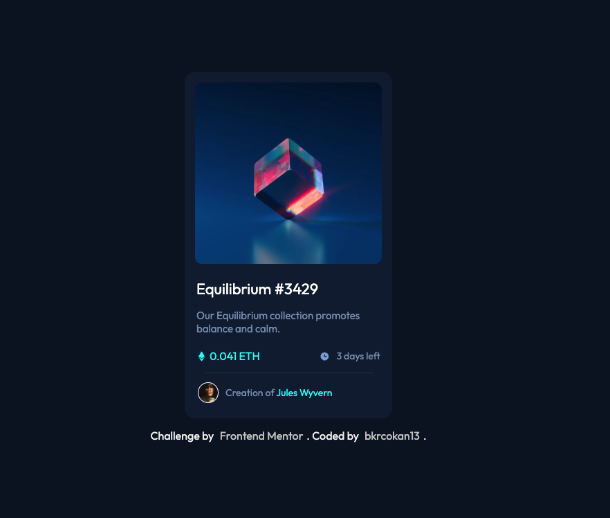

# NFT Preview Card

A stylish and modern NFT preview card component that showcases artwork or collectibles in a visually appealing way. This project demonstrates the use of HTML, CSS, and JavaScript to create an engaging preview card for NFTs.

## Table of Contents
- [Demo](#demo)
- [Features](#features)
- [Technologies Used](#technologies-used)
- [Installation](#installation)
- [Usage](#usage)
- [Screenshot](#screenshot)
- [License](#license)
- [Contact](#contact)

## Demo

Check out the live demo: [NFT Preview Card Demo](https://main--tourmaline-sunshine-5327d1.netlify.app/)
## Features

- Modern and attractive design for showcasing NFTs.
- Responsive layout that adapts to different screen sizes.
- Interactive elements such as hover effects and clickable areas.
- Clean and organized structure with customizable styles.

## Technologies Used

- **HTML5**: For structuring the NFT preview card.
- **CSS3**: For styling and responsive design.
- **JavaScript**: For any interactive features (if applicable).

## Installation

1. Clone the repository:

    ```bash
    git clone https://github.com/bkrcokan13/nft-preview-card.git
    cd nft-preview-card
    ```

2. Open `index.html` in your browser. (You can use extensions like **Live Server** for Visual Studio Code to launch a local development server for easier testing and development.)

## Usage

1. Open the `index.html` file in your browser to view the NFT preview card.
2. Customize the card content and styles as needed to fit your project.

## Screenshot

Here is a screenshot of the NFT Preview Card:


## License

This project is licensed under the MIT License - see the [LICENSE](LICENSE) file for details.

## Contact

Created by [Okan Bakırcı](https://github.com/bkrcokan13) - feel free to contact me!